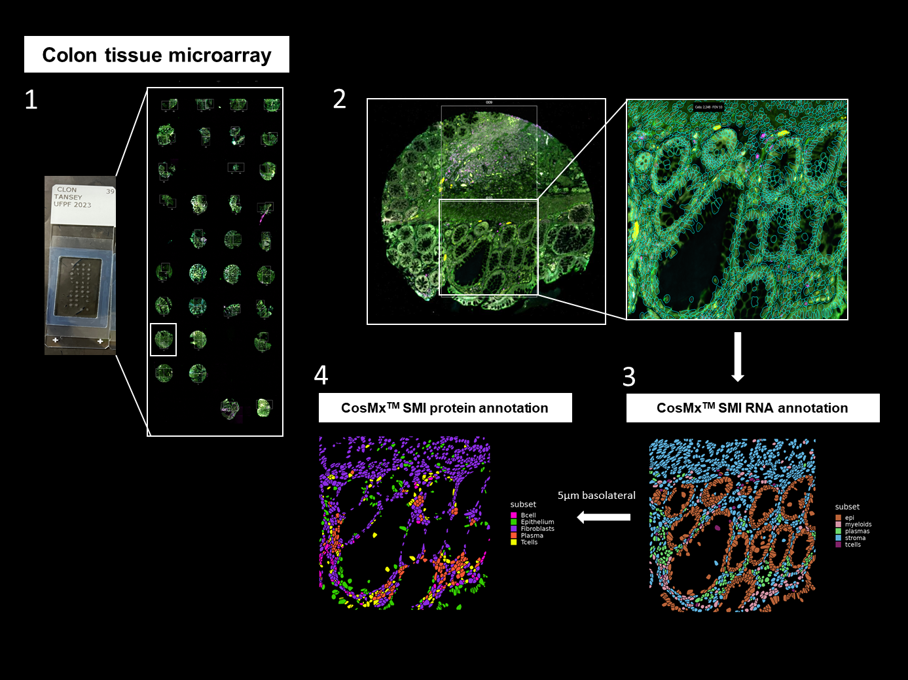

# Spatial Multiomics Analysis – CosMx RNA & Protein

## General Information

**Generated:** 12/12/2024
**Last modified:** 19/11/2025

This repository contains all scripts, data structures, and figure-generation code used in the study:

> **“Spatial single-cell multiomics reveals peripheral immune dysfunction in Parkinson’s and inflammatory bowel disease”**

The dataset includes measurements acquired using **NanoString CosMx™ Spatial Multiomics** in **2023**, comprising:

- **CosMx RNA profiling**  
- **CosMx Protein profiling**

Analyses were performed using:

- **R ≥ 4.3.2**  
- **Python ≥ 3.8.10**

Environment dependencies are provided in:

- `requirements_python.txt`  
- `requirements_r.txt`



---

## File Overview

### `/data/`
Directory reserved for **raw input data** (not included in this repository).  
Users should place their CosMx raw files here to reproduce the analysis.

### `/analysis/`
Contains complete analysis pipelines for both modalities:

- **CosMx_Protein/**
- **CosMx_RNA/**

Each includes a detailed README describing preprocessing, QC, annotation, interaction analysis, and intermediate outputs.

### `/figures/`
Code to reproduce every figure included in the manuscript.

### Requirements Files
- `requirements_python.txt` – Python environment (cell–interaction pipeline)  
- `requirements_r.txt` – R environment (full CosMx workflow)

---

## Naming Conventions & Repository Structure

This repository uses a structured, modular naming scheme for methodical and reproducible analysis.

### Analysis Naming Logic
Scripts follow **numeric prefixes** to reflect the analysis workflow:

- **`0_*`** → Curation & raw processing  
- **`1_*`** → Annotation or normalization (modality-specific)  
- **`2_*`** → Cell typing workflows  
  - Includes both `.R` and `.py` scripts when required  
- **`3_*`** → Cell–cell interaction (scotia pipeline)

Additional analysis utilities include:
- `abundance_enrichment.R`
- `scotia_cell_int.py`

### Data-Type Directories

Subfolders indicate the nature of stored data:

- `Files/` – intermediate files  
- `Molecules/` – molecule-level CosMx outputs  
- `Polygons/` – segmentation polygons  
- `Objects/` – Seurat objects or metadata  
- `Markers/` – marker definitions used in annotation  
- `Results/` – exported results and final outputs

### Figures
Figures follow the convention:

`figure1.R`, `figure2.R`, … `sup_figN.R`

Image exports are stored within:  
`figures/plots/`

---

## Full Repository Structure
```
├── CosMx-Bolen.Rproj
├── LICENSE
├── README.md
├── README.html
├── image.png
├── requirements_python.txt
├── requirements_r.txt
│
├── analysis/
│   ├── CosMx_Protein/
│   │   ├── 0_curation.R
│   │   ├── 1_normalization.R
│   │   ├── 2.0_celltyping.R
│   │   ├── 2.1_celltyping.py
│   │   ├── 2.2_celltyping.R
│   │   ├── 3_cell_interaction.R
│   │   ├── abundances_enrichment.R
│   │   ├── scotia_cell_int.py
│   │   ├── Files/
│   │   ├── Objects/
│   │   │   └── db.csv
│   │   ├── Polygons/
│   │   ├── Results/
│   │   └── Ensembl Cosmx protein.xlsx
│   │
│   └── CosMx_RNA/
│       ├── 0_curation.R
│       ├── 1_annotation_supervised.R
│       ├── 2.normalization.R
│       ├── 3_cell_interaction.R
│       ├── abundance_enrichment.R
│       ├── Files/
│       ├── Markers/
│       ├── Molecules/
│       ├── Objects/
│       ├── Polygons/
│       └── Results/
│
├── data/
│
└── figures/
    ├── figure1.R
    ├── figure2.R
    ├── figure3.R
    ├── figure4.R
    ├── figure6.R
    ├── plots/
    ├── sup_fig1.R
    ├── sup_fig3.R
    ├── sup_fig4.R
    ├── sup_fig5.R
    ├── sup_fig6.R
    └── sup_fig7.R
```


---

## Methodology Overview

Both CosMx RNA and Protein pipelines follow a standardized workflow:

1. **Curation**
   - Create Seurat objects  
   - Extract molecules, polygons, objects into separate folders to maintain structure and reduce memory load  

2. **Normalization & QC**

3. **Cell Annotation**
   - Supervised annotation workflow  

4. **Abundance & Enrichment Analysis**

5. **Cell–Cell Interaction**
   - Implemented using the **scotia** Python-based pipeline (`scotia_cell_int.py`)

---

## Data Access & Funding

This research was funded in whole or in part by Aligning Science Across Parkinson’s (ASAP-020527) through the Michael J. Fox Foundation for Parkinson’s Research (MJFF).

---

### License
**MIT LICENSE**.

### Citation
If using data or code from this folder, cite:  
**Bolen et al., 2025. Spatial single-cell multiomics reveals peripheral immune dysfunction in Parkinson’s and inflammatory bowel disease.**
